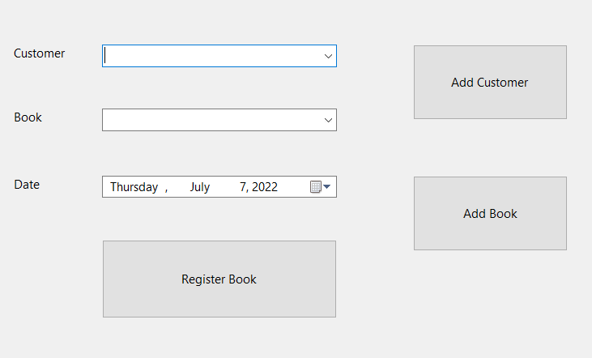
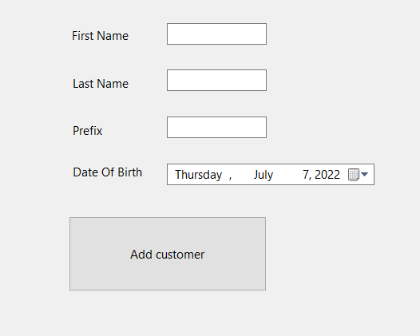
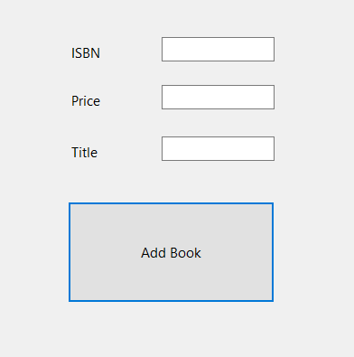

# Book Registration App
This app is my first implementation of OOP. In this application you can add customers and books to a list, then access those entered books and customers on the main page in the drop down menus. Then the customers, books, and registered books are all stored in a SQL database for the application to access.

# Main Registration

# Customer Registration

# Book Registration

